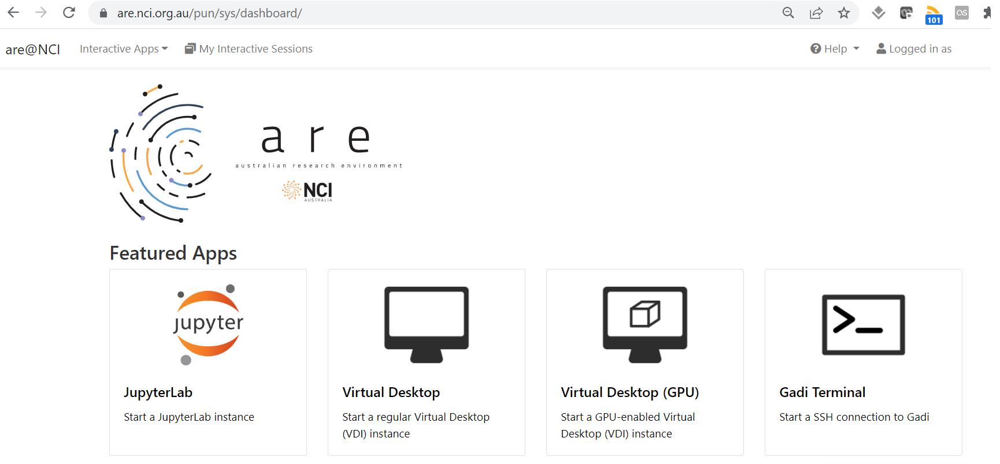

(Gadi)=
# NCI Gadi HPC and ARE australian research environment

The NCI's peak system **"Gadi"** is a large **high performance computer** ideal for numerical modelling and computationally intensive jobs. This HPC supports the ACCESS climate model that contributes to CMIP submissions as well as development by ACCESS staff at ACCESS-NRI, BoM, CSIRO and university collaborators. NCI's Gadi system is also used to run regional models such as WRF and CCAM, as well as many field-specific models (CABLE, WaveWatchIII, AWRA to name a few). 

NCI provides:
- a `/home` directory for each user where code can be stored (but typically not data), 
- a `/scratch` area for each project which is a highly performant filesystem appropriate for IO intensive jobs, 
- a `/g/data` global filesystem space for most projects for longer term storage of data such as for sharing and publication,
- the `MDSS` mass datastore facility for data archiving/backup.
- help via help@nci.org.au as well as specialised climate support from CLEX, BoM and CSIRO support staff via cws-help@nci.org.au.

The HPC ("Gadi") is usually accessed via the command line to login nodes, which support internet access. Tasks to be run on the HPC compute nodes are described in "job scripts" which are submitted to a batch queuing system to ensure fair use of the resources. 

The NCI also supports an interface to the HPC infrastructure called the **Australian Research Environment (ARE)**. The ARE provides a web-based interface to Gadi via a virtual desktop infrastructure (VDI) on a compute node, or a JupyterLab session. Gadi terminals can also be accessed in a browser via the ARE. 

Internet access is not available from Gadi compute nodes, so all downloads/repository cloning and `git` work needs to be done on login nodes (terminal) or in `analysis` or `copyq` ARE jobs (or using the [OOD](https://acdguide.github.io/BigData/platforms/platforms-nci-ood.html) instead). Despite general lack of internet access, the ARE is excellent for `dask`-based data analysis. Documentation can be [found here](https://opus.nci.org.au/display/Help/ARE+User+Guide).

The ARE service is accessed via an OpenOnDemand launcher page which creates a job with access to the requested compute and storage resources.

Launching the VDI via the button gives access to a familiar linux graphical interface, while the JupyterLab support connection to existing conda environments.

## When would I use this system? 

- Gadi is intended for large scale modelling and data processing jobs. If you are running parallel numerical models at scale then you would likely work exclusively on Gadi or a similar system. It is also useful for "high throughput computing" like AI/ML workflows, and "high performance data" parallel data processing using Pangeo tools like python's `dask` library - though usually you would start exploratory data work on the NCI's virtual desktop or JupyterLab via the ARE and move to Gadi batch jobs when greater scalability is required.

- NCI is an ideal platform to use when collaborating with peers from other institutions as it is available to all Australian researchers. 
- If you are wanting to use large reference climate datasets as input for your research, chances are the data you want may already be available at NCI, which saves you time downloading and managing the datasets, and it is more efficient for everyone to use these centralised collections.
- If you need to work interactively using code in your Gadi `/home` directory, the ARE provides a JupyterLab or VDI environment with access to Gadi's `/home`, `/scratch` and `/g/data` filesystems and is the recommended tool for users looking to perform interactive large-scale data analysis. If internet access is required, however, you might consider using the [OOD](https://acdguide.github.io/BigData/platforms/platforms-nci-ood.html). 
- If you want to use large numbers of compute cores or memory to perform large-scale data analysis, the ARE is the tool of choice.

> There are also [helper scripts](https://github.com/coecms/nci_scripts) such as `gadi_jupyter` provided by the CLEX CMS team though these are largely deprecated in favour of the ARE or OOD. 

## How do I get access? 
Sign up for an account at [my.nci.org.au](https://my.nci.org.au/mancini/). You need to join an existing computational project - talk to your supervisors or colleagues for suggested project codes. As well as joining at least one "compute" project, once access is granted you will also need to use the same portal to request access to "data" projects for the data you need to work with, for example, `oi10` for replicated CMIP6 data, or `hh5` for the CLEX-run community conda environments.

* To log on to Gadi HPC, in a terminal type 

`ssh <username>@gadi.nci.org.au`.

For further information, see the [Gadi user guide](https://opus.nci.org.au/display/Help/Gadi+User+Guide).

* To access the ARE, navigate to [are.nci.org.au/](https://are.nci.org.au/)

---
**NOTE** 

ARE usage is now charged against compute projects, unlike the older VDI and OOD. 

Request only as much time/as many cores as you need.

---
