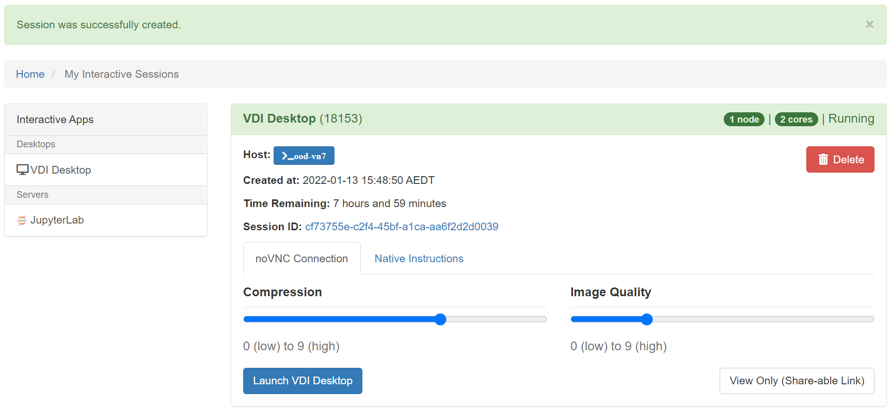
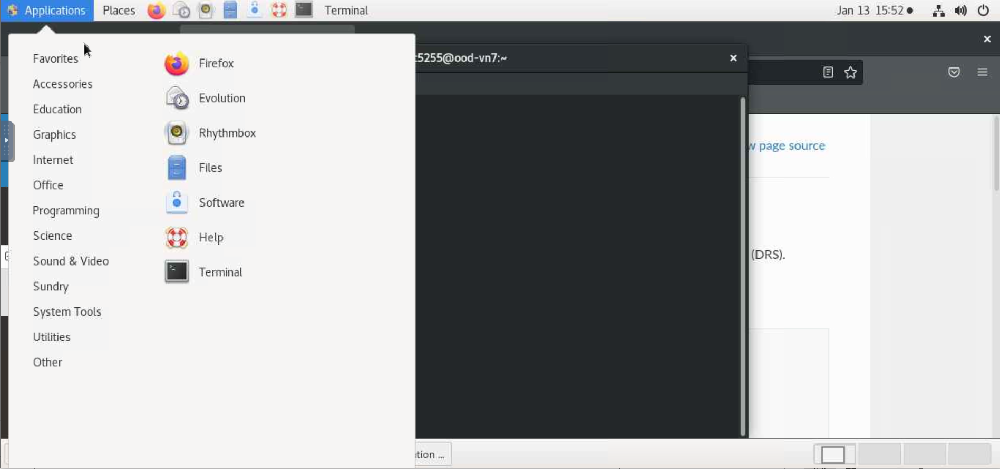

(OOD)=
## NCI OOD Virtual Desktop Infrastructure

**NOTE that NCI have recently launced their ARE platform, which may ultimately replace this OOD offering, this information is current as of July 2022.**

The NCI also support a virtual desktop infrastructure (VDI) called "Open, On-Demand" (OOD) hosted on their internal cloud infrastructure, and which provides an interface to the HPC infrastructure. The current generation of the VDI is web-based, offering a virtual desktop service mimicking the older 'Strudel' interface, and a Jupyter Notebook server. Documentation can be [found here](https://opus.nci.org.au/display/OOD/Open+OnDemand+%28OOD%29+Service).

The OOD VDI service is accessed via a cloud launcher page which creates an image with access to the requested compute resources and looks like this:

Launching the VDI desktop via the button gives access to a familiar linux graphical interface with a terminal, browser and various applications.

### When would I use the OOD VDI?
The "OOD" or "VDI" is ideal for exploratory and interactive work such as code development, data exploration and visualisation, and tasks requiring internet access (e.g. working with data from external sources via OPeNDAP or S3, or installing python libraries).

As with Gadi, the OOD VDI has access to all the climate data stored at NCI*, so it is an ideal place to work when large scale input data is required (as this minimises effort and risk associated with creating copies of input data). 

\***Note that the VDI shares *only* the `/g/data` filesystems with Gadi**, data on other Gadi filesystems is not visible on the VDI and the two systems do not share a common `/home` directory. From the VDI you cannot see Gadi's `/scratch` space, and conversely in the VDI you have access to a `/short` project directory which is available only within the VDI environment.

### How do I get access?

Same as Gadi. Sign up for an account at [my.nci.org.au](https://my.nci.org.au/mancini/). You need to join an existing computational project - talk to your supervisors or colleagues for suggested project codes. As well as joining at least one "compute" project, once access is granted you will also need to use the same portal to request access to "data" projects for the data you need to work with, for example, `oi10` for replicated CMIP6 data, or `hh5` for the CLEX-run community conda environments.

### FAQ

The OOD documentation contains a few [useful FAQs](https://opus.nci.org.au/display/OOD/OOD+FAQ), including:
- `/home` space over quota
- sessions go straight from launching to "completed", can't log in (this is a conda issue!)
- resource limitations 
- other assorted login problems

Additional tips:
- Sometimes users report seeing `Bad Request
Your browser sent a request that this server could not understand.
Size of a request header field exceeds server limit.`
This can be resolved by deleting the cookies for OOD, it is a known issue and NCI recommend working in a private/incognito browser window.